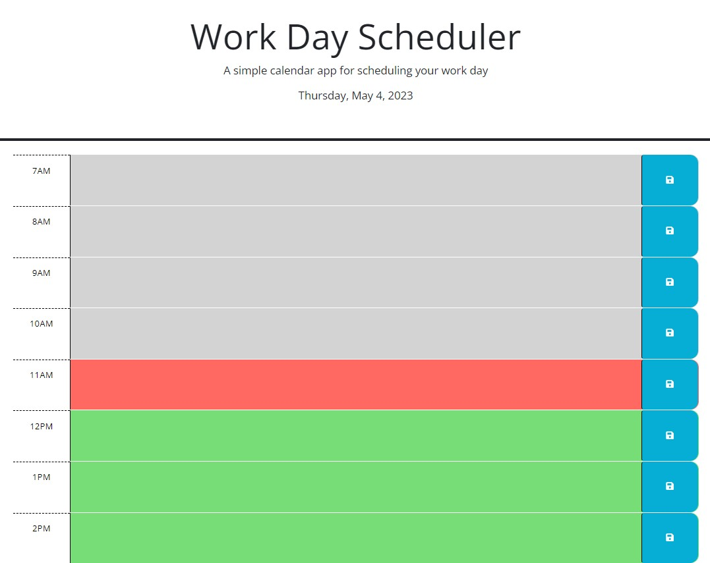
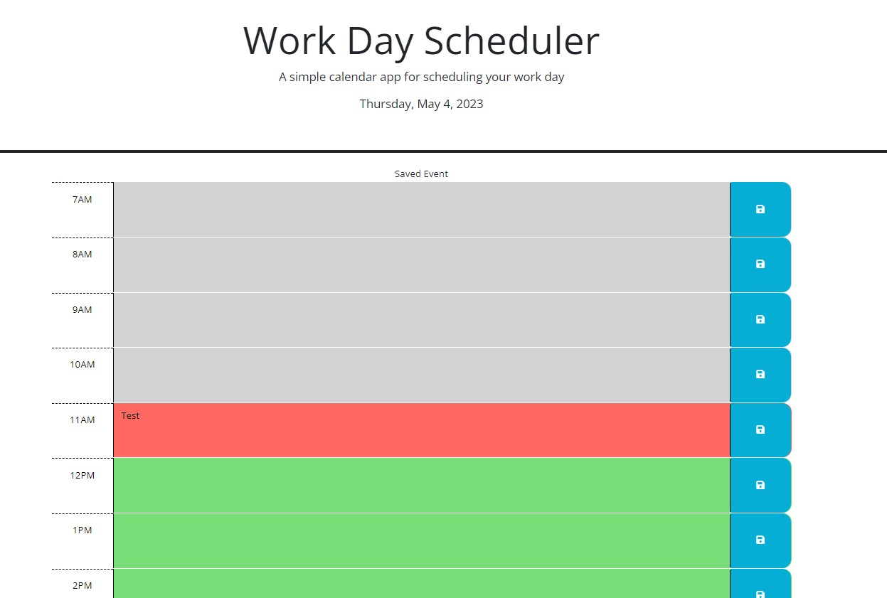

# DayCalendar
## This is a simple daily planner that allows users to enter and save tasks/events for different hours of the day. The application also displays the current date. The planner will change colors depending on if the current hour block has past, will come up or currently in the hour.

# Getting Started
## To use this application, open the GitHub Page link to open the web page. The current date will be displayed at top and the hour blocks will be displayed underneath. Type in any event/task the user would like the planner to remember and press the save button next to the left edge of the text box. The event/task will be saved and will populate the saved information when the user returns. The webpage will notify the user that the event has been saved.

# Screenshots
## Landing Page

## Notification of Saved Event
   

# Features
* Displays the current date and time
* Allows users to enter and save tasks for different hour blocks
* Applies different color schemes to indicate past (Grey), present (Light Red) or future (Green)
* Saves tasks in the browser's local storage for persistence

# Technologies Used
* jQuery (https://jquery.com/)
* Day.js (https://day.js.org/)

# Credits
## This was made by BootCamp Staff and Andrew Hur

# Links
[Deployed GitHub Page](https://athur1104.github.io/DayCalendar/)